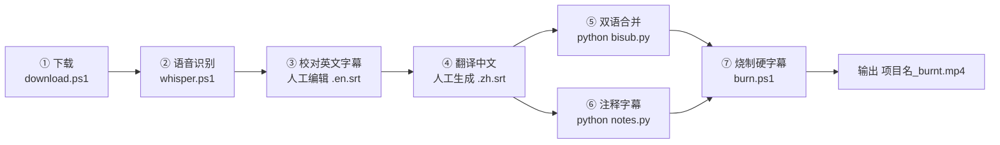

# VideoSub — 油管视频中英双语字幕工作流

本工作区用于**下载油管视频 → 识别/校对英文字幕 → 翻译中文字幕 → 生成双语 ASS 字幕（含注释）→ 烧制硬字幕**的完整流水线。

每个视频项目一个独立文件夹（以项目名命名），核心状态通过根目录的 `current.txt` 记录"当前项目"，让后续脚本无需重复传参。

---

## 工作流总览



| 步骤 | 脚本 | 输入 | 输出 | 环节 |
|---|---|---|---|---|
| ① 下载 | `download.ps1` | 视频 URL + 项目名 | `项目名.mp4`、`项目名.jpg`、`info.txt` | 自动 |
| ② 识别 | `whisper.ps1` | `项目名.mp4` | `项目名.en.srt` | 自动 |
| ③ 校对 | —（人工） | `项目名.en.srt` | 修订后的 `项目名.en.srt` | 人工 |
| ④ 翻译 | —（人工） | `项目名.en.srt` | `项目名.zh.srt` | 人工 |
| ⑤ 双语合并 | `bisub.py` | `.zh.srt` + `.en.srt` | `项目名.ass` | 自动 |
| ⑥ 注释（可选） | `notes.py` | `notes.srt` | `notes.ass` | 自动 |
| ⑦ 烧制 | `burn.ps1` | `项目名.ass`（+`notes.ass`）+ `项目名.mp4` | `项目名_burnt.mp4` | 自动 |

---

## 目录结构

```
VideoSub/
├── README.md            # 本文档
├── current.txt          # 当前项目名（一行文本，无 BOM）
├── download.ps1         # 步骤① 下载
├── whisper.ps1          # 步骤② 语音识别
├── bisub.py             # 步骤⑤ 双语合并
├── notes.py             # 步骤⑥ 注释字幕转换
├── burn.ps1             # 步骤⑦ 烧制硬字幕
├── <项目名>/            # 每个项目一个文件夹
│   ├── <项目名>.mp4     # 原始视频
│   ├── <项目名>.jpg     # 缩略图（封面）
│   ├── info.txt         # 视频元信息（URL/标题/作者/日期）
│   ├── <项目名>.en.srt  # 英文原文字幕（识别+校对后）
│   ├── <项目名>.zh.srt  # 中文翻译字幕（人工）
│   ├── <项目名>.ass     # 双语字幕（bisub.py 生成）
│   ├── notes.srt        # 可选：注释字幕（人工编写）
│   ├── notes.ass        # 注释字幕（notes.py 生成）
│   └── <项目名>_burnt.mp4  # 最终烧制成品
└── _archive/            # 完成项目的归档目录
```

---

## current.txt 机制（重要）

- 根目录 `current.txt` 存一行**项目名**（UTF-8，无 BOM）。
- `download.ps1` 每次下载成功后会**自动写入**当前项目名。
- `whisper.ps1`、`burn.ps1`、`bisub.py`、`notes.py` 在**不带参数**运行时，都会默认读取 `current.txt` 作为项目名。
- 手动切换项目时，直接修改 `current.txt` 内容，或给脚本传项目名参数即可。

---

## 脚本速览

> 各脚本的详细用法、参数与注意事项见 `skills/subtitle-workflow/SKILL.md`。

### ① `download.ps1` — 下载视频

```powershell
.\download.ps1 -Url "https://youtu.be/xxx" -Name "ProjectName"   # 参数均必填
```

用 yt-dlp 下载 `399+140` 视频与缩略图，抓取元信息到 `info.txt`，并写入 `current.txt`。产物：`项目名.mp4`、`项目名.jpg`、`info.txt`。

---

### ② `whisper.ps1` — 语音识别生成英文字幕

```powershell
.\whisper.ps1                                  # 缺省读 current.txt
.\whisper.ps1 -ProjectName "ProjectName"
```

用 faster-whisper-xxl（模型 large-v3）识别音频，将 SRT 重命名为 `项目名.en.srt`。

---

### ③ 校对英文字幕（人工）

**对象**：`<项目名>/<项目名>.en.srt`

**要点**：
- 找出识别错误：明显误听、语义不通的句子，按语境修正
- 术语/专有名词规范书写（识别常漏、拼写与大小写不规范）
- **不立即修改**：先分类汇报问题 → 等用户确认、查缺补漏 → 获允许后逐步修正
- 保持 SRT 格式完全一致：编号、时间轴、文本、条目间空行

---

### ④ 翻译中文字幕（人工）

**对象**：由校对后的 `.en.srt` 生成 `<项目名>/<项目名>.zh.srt`

**约定**：
- 保持 SRT 格式完全一致：编号、时间轴、文本、条目间空行；**时间与英文完全一致**，但可调整语序使表述自然
- 行末不加句号（。）、逗号（，）、顿号（、）；问号（？）和感叹号（！）保留
- 多行字幕条目需保持原有行数结构
- 贴合语境：按视频情景与原作者语气斟酌用词（专业 vs 口语化）
- 术语/专有名词翻译要准确，可查询确认；游戏术语按既定译名
- 翻译以**表格形式汇报**给用户，便于确认与修正

---

### ⑤ `bisub.py` — 合并为双语 ASS 字幕

```bash
python bisub.py [ProjectName]
```

合并 `.zh.srt` + `.en.srt` 为单行双语 ASS（中文上、英文下，英文小字号）。默认按序号对齐（要求行数一致），可改脚本顶部 `ALIGN_MODE="time"` 按时间轴匹配。产物：`项目名.ass`。

---

### ⑥ `notes.py` — 注释字幕转换（可选）

```bash
python notes.py [ProjectName]
```

将人工编写的 `notes.srt` 转换为顶端对齐、淡入淡出的 `notes.ass`；无 `notes.srt` 时静默跳过。

---

### ⑦ `burn.ps1` — 烧制硬字幕

```powershell
.\burn.ps1                                  # 缺省读 current.txt
.\burn.ps1 -ProjectName "ProjectName"
```

用 ffmpeg 将 `项目名.ass`（及可选的 `notes.ass`）烧进视频，输出 `项目名_burnt.mp4`。

---

## 典型完整流程示例

```powershell
# 1. 下载（自动写入 current.txt）
.\download.ps1 -Url "https://youtu.be/xxx" -Name "MyProject"

# 2. 识别英文字幕
.\whisper.ps1

# 3. 人工：校对 MyProject.en.srt，翻译生成 MyProject.zh.srt

# 4. 生成双语 ASS
python bisub.py

# 5. 可选：编写 MyProject/notes.srt 后转换
python notes.py

# 6. 烧制硬字幕
.\burn.ps1
```

---

## 依赖清单

| 工具 | 用途 | 备注 |
|---|---|---|
| `yt-dlp` | 下载视频 | 需在 PATH |
| `ffmpeg` | 烧制硬字幕 | 需在 PATH |
| `faster-whisper-xxl.exe` | 语音识别 | 路径 `D:\Faster-Whisper-XXL\`，模型 large-v3 |
| `python` + `pysubs2` | 字幕格式转换/合并 | `bisub.py`、`notes.py` 依赖 |
