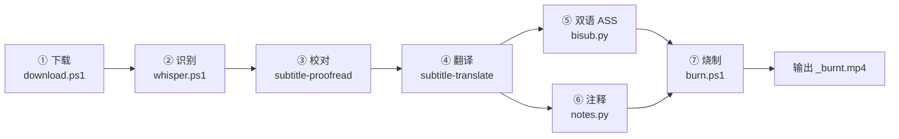

# VideoSub 字幕工作流 — 使用说明书

## 概述

本技能是 VideoSub 工作区（油管视频 → 中英双语硬字幕）的**使用说明书**。工作区根目录 `README.md` 提供概览；本技能面向**实际调用**，给出每个脚本的完整用法与细节，是智能体执行流水线时的操作指南。

完整流程：



## 项目与 current.txt 机制

- 每个视频一个项目文件夹，以项目名命名
- 根目录 `current.txt` 存一行项目名（UTF-8，无 BOM），表示"当前项目"
- `download.ps1` 下载成功后**自动写入** `current.txt`
- `whisper.ps1` / `burn.ps1` / `bisub.py` / `notes.py` 缺省参数时**自动读取** `current.txt`
- 切换项目：修改 `current.txt`，或给脚本显式传项目名

---

## ① `download.ps1` — 下载视频

**用途**：下载视频、缩略图并抓取元信息。

```powershell
.\download.ps1 -Url "<视频网址>" -Name "<项目名>"
```

**参数**：
| 参数 | 必填 | 说明 |
|---|---|---|
| `-Url` | 是 | 视频网址；含 `/shorts/` 时 info.txt 中的链接用短链形式 |
| `-Name` | 是 | 项目名，同时作为文件夹名与文件名前缀 |

**细节**：
- 自动创建 `<Name>\` 文件夹
- 用 yt-dlp 下载 `399+140`（1080p 视频 + 音频），输出 `项目名.mp4`
- `--write-thumbnail --convert-thumbnails jpg` → `项目名.jpg`（网络异常时仅告警，不中断）
- 抓取标题/作者/日期/视频 ID 写入 `info.txt`；抓取失败则写占位符 `?`
- 下载成功后把项目名写入 `current.txt`

**产物**：`<项目名>/<项目名>.mp4`、`<项目名>.jpg`、`info.txt`
**依赖**：`yt-dlp` 在 PATH 中

---

## ② `whisper.ps1` — 语音识别

**用途**：对视频做语音识别，生成英文原文字幕。

```powershell
.\whisper.ps1                        # 读取 current.txt
.\whisper.ps1 -ProjectName "项目名"   # 显式指定
```

**细节**：
- 输入：`<项目名>/<项目名>.mp4`（不存在则报错退出）
- 调用 faster-whisper-xxl，模型 `large-v3`，参数 `-pp --check_files --standard -f srt`
- 生成 SRT 后重命名为 `<项目名>.en.srt`（若已存在则先删除再移动）
- 依赖：faster-whisper-xxl 可执行文件（路径已在脚本内配置）

**产物**：`<项目名>/<项目名>.en.srt`

---

## ③ 校对英文字幕（人工）

审阅 `.en.srt`，找出识别错误并**分类汇报**，经用户确认后逐步修正。详见 `subtitle-proofread` 技能。

**产物**：修订后的 `<项目名>/<项目名>.en.srt`

---

## ④ 翻译中文字幕（人工）

将校对后的 `.en.srt` 逐条翻译为中文，输出 `.zh.srt`。详见 `subtitle-translate` 技能。

**产物**：`<项目名>/<项目名>.zh.srt`

---

## ⑤ `bisub.py` — 合并双语 ASS

**用途**：合并 `.zh.srt` + `.en.srt` 为**单行双语** ASS（中文在上、英文在下）。

```bash
python bisub.py                # 读取 current.txt
python bisub.py 项目名          # 显式指定
```

**细节**：
- 输入：`<项目名>.zh.srt` + `<项目名>.en.srt`（两者都必须存在）
- 默认 `ALIGN_MODE="index"`：按序号一一对应，**要求中英文行数一致**，否则报错并提示改用 `time` 模式
- 可选 `ALIGN_MODE="time"`：按时间轴匹配，容差 `TIME_THRESHOLD_MS=500`ms；未匹配的中文行输出空英文并在结束时警告条数
- 样式由脚本顶部 `STYLE` 常量控制（字体/字号/颜色/描边），画布 `1920×1080`
- 英文行附加小字标签 `\fs50\bord2.5`，中文行无标签
- 依赖：`python` + `pysubs2`

**产物**：`<项目名>/<项目名>.ass`

---

## ⑥ `notes.py` — 注释字幕（可选）

**用途**：把人工编写的 `notes.srt` 转为**顶端对齐**的注释字幕 `notes.ass`，用于在画面顶部补充术语/背景解释。

```bash
python notes.py                 # 读取 current.txt
python notes.py 项目名           # 显式指定
```

**细节**：
- 输入：`<项目名>/notes.srt`；**不存在则静默跳过**（不报错，正常返回）
- 样式：微软雅黑 50 号、顶端对齐（`Alignment=8`）、`\fad(500,500)` 淡入淡出
- 依赖：`python` + `pysubs2`

**产物**：`<项目名>/notes.ass`

---

## ⑦ `burn.ps1` — 烧制硬字幕

**用途**：把 ASS 字幕烧进视频（硬编码，播放器无法关闭）。

```powershell
.\burn.ps1                        # 读取 current.txt
.\burn.ps1 -ProjectName "项目名"   # 显式指定
```

**细节**：
- 校验 `<项目名>.mp4` 与 `<项目名>.ass` 存在（缺失则报错退出）
- 若存在 `notes.ass`：叠加两层滤镜 `subtitles=项目名.ass,subtitles=notes.ass`
- 否则仅烧制双语字幕
- 在**项目目录内**执行 ffmpeg（避免滤镜路径转义/斜杠问题）
- 音频直接拷贝 `-c:a copy`，不重编码
- 依赖：`ffmpeg` 在 PATH 中

**产物**：`<项目名>/<项目名>_burnt.mp4`

---

## 端到端示例

```powershell
# 1. 下载（自动写 current.txt）
.\download.ps1 -Url "https://youtu.be/xxx" -Name "MyProject"

# 2. 识别英文字幕
.\whisper.ps1

# 3. 人工：校对 MyProject.en.srt（调用 subtitle-proofread）
# 4. 人工：翻译生成 MyProject.zh.srt（调用 subtitle-translate）

# 5. 生成双语 ASS
python bisub.py

# 6. 可选：编写 MyProject/notes.srt 后转换
python notes.py

# 7. 烧制硬字幕
.\burn.ps1
```

## 注意事项

- 中英文 SRT **行数必须一致**（`bisub.py` 默认 index 对齐的前提）
- 翻译不要改动英文时间轴与条目数
- 每个脚本均可独立运行，也可按上述顺序串联
- 完成的项目可移入 `_archive/` 归档
